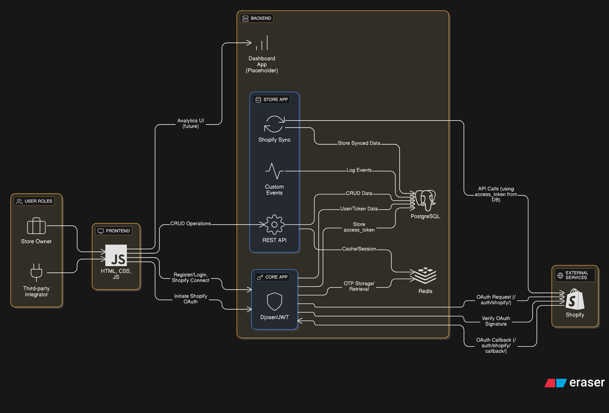

This project is part of the Xeno FDE Internship Assignment – 2025.

# Shop-Lytics

Shop-Lytics is a web application for Shopify store analytics.

## Setup Instructions

1.  **Clone the repository:**
    ```bash
    git clone https://github.com/ForkMeMaybe/Shop-Lytics.git
    cd shop-lytics
    ```

2.  **Install dependencies:**
    This project uses Pipenv for dependency management.
    ```bash
    pipenv install
    pipenv shell
    ```
    Alternatively, you can use the `requirements.txt` file:
    ```bash
    pip install -r requirements.txt
    ```

3.  **Run database migrations:**
    ```bash
    python manage.py migrate
    ```
4. **Rename shop_lytics/settings/devv.py to shop_lytics/settings/dev.py**

5. **Configure the environement vars in dev.py**

6.  **Start the development server:**
    ```bash
    python manage.py runserver
    ```

7. **Run Redis:**
    ```
    docker run -d -p 6379:6379 redis
    ```

8. **Database SQLite For Quick Access OR Set up credentials for Postgres in dev.py (Recommended)**

## Architecture Diagram



## API Endpoints

### Authentication

*   `/auth/users/` (CREATE User or GET basic info about them)
*   `/auth/users/me/` (RUD details about the user)
*   `/auth/users/set_password/`
*   `/auth/users/reset_password/`
*   `/auth/users/reset_password_confirm/`
*   `/auth/jwt/create/` (GET ACCESS Token)
*   `/auth/jwt/refresh/` (Refresh ACCESS Token)

### Core

*   `/send_otp/`
*   `/verify_otp/`
*   `/auth/shopify/` (OAuth)
*   `/auth/shopify/callback/` (OAuth)

### Store

*   `/api/tenants/`
*   `/api/tenants/<int:pk>/`
*   `/api/customers/`
*   `/api/customers/<int:pk>/`
*   `/api/products/`
*   `/api/products/<int:pk>/`
*   `/api/orders/`
*   `/api/orders/<int:pk>/`
*   `/api/custom-events/`

## Database Schema

### Core App

*   **User:**
    *   `email` (EmailField, unique)
    *   Inherits from Django's `AbstractUser`.

### Store App

*   **Tenant:**
    *   `user` (OneToOneField to User)
    *   `name` (CharField)
    *   `shopify_domain` (CharField, unique)
    *   `access_token` (CharField)
    *   `created_at` (DateTimeField)
*   **Customer:**
    *   `tenant` (ForeignKey to Tenant)
    *   `shopify_customer_id` (BigIntegerField, unique)
    *   `first_name` (CharField)
    *   `last_name` (CharField)
    *   `email` (EmailField)
    *   `phone` (CharField)
    *   `address1` (CharField)
    *   `address2` (CharField)
    *   `city` (CharField)
    *   `province` (CharField)
    *   `country` (CharField)
    *   `zip` (CharField)
    *   `company` (CharField)
    *   `created_at` (DateTimeField)
    *   `updated_at` (DateTimeField)
*   **Product:**
    *   `tenant` (ForeignKey to Tenant)
    *   `shopify_product_id` (BigIntegerField, unique)
    *   `title` (CharField)
    *   `description` (TextField)
    *   `price` (DecimalField)
    *   `sku` (CharField)
    *   `inventory_quantity` (IntegerField)
    *   `created_at` (DateTimeField)
    *   `updated_at` (DateTimeField)
*   **Order:**
    *   `tenant` (ForeignKey to Tenant)
    *   `shopify_order_id` (BigIntegerField, unique)
    *   `customer` (ForeignKey to Customer)
    *   `total_price` (DecimalField)
    *   `currency` (CharField)
    *   `financial_status` (CharField)
    *   `fulfillment_status` (CharField)
    *   `created_at` (DateTimeField)
    *   `updated_at` (DateTimeField)
*   **OrderItem:**
    *   `order` (ForeignKey to Order)
    *   `product` (ForeignKey to Product)
    *   `quantity` (IntegerField)
    *   `price` (DecimalField)
*   **CustomEvent:**
    *   `tenant` (ForeignKey to Tenant)
    *   `event_type` (CharField)
    *   `customer` (ForeignKey to Customer)
    *   `metadata` (JSONField)
    *   `created_at` (DateTimeField)

## Known Limitations and Assumptions

### Limitations

1.  `access_token` is not stored in encrypted form.

### Assumptions

1.  Each user manages one store.
